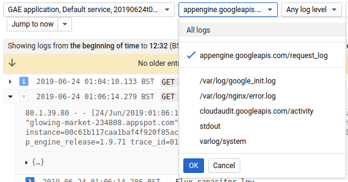
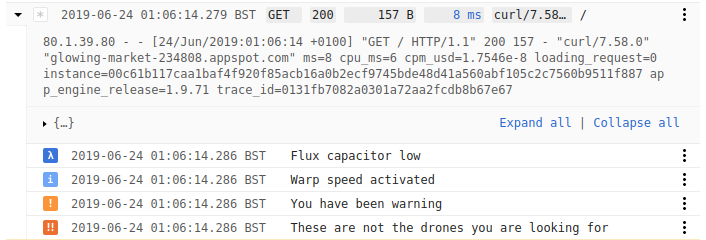
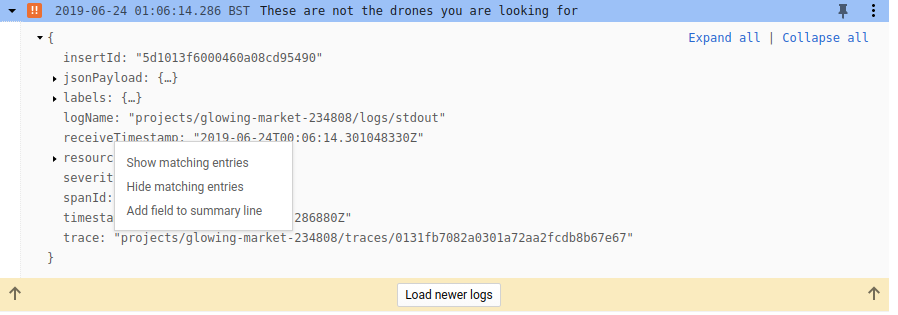
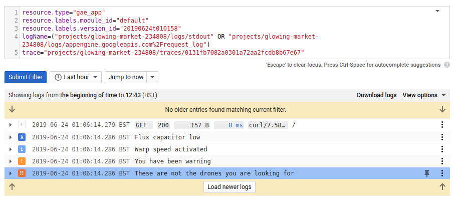
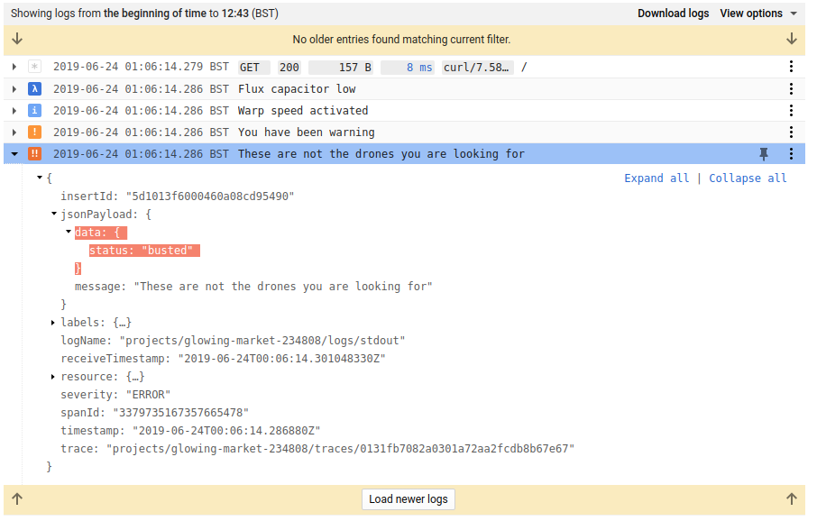

# Stackdriver GAE Logrus Plugin

[Logrus is a structured logger for Go](https://github.com/sirupsen/logrus) compatible with the standard library logger.

Stackdriver GAE Logrus Plugin is a lightweight plugin providing threaded message entries on Google App Engine (GAE) Standard Environment.

GAE adds a request header `X-Cloud-Trace-Context` to HTTP requests. `middleware.XCloudTraceContext` provides an HTTP Middleware component that parses this header and make it available in the context.


``` go
contextLogger := log.WithContext(r.Context())

contextLogger.WithFields(log.Fields{
	"battery": "50",
}).Debug("Flux capacitor low")

contextLogger.WithFields(log.Fields{
	"status": "busted",
}).Info("Warp speed activated")

contextLogger.WithFields(log.Fields{
	"status": "hmmm",
}).Warn("You have been warning")

contextLogger.WithFields(log.Fields{
	"status": "busted",
}).Error("These are not the drones you are looking for")
```

In the Stack Driver Logging Cloud Console you can filter results by request.



Opening up an individual request will show each log entry nested within. Each entry will have a color code icon showing its severity corrsponding to its nearest equivilent Logrus level.




Whilst debugging select any individual log message's `trace` value and click "Show matching entries".




This will automatically set the filters to reveal all log entries associated to that HTTP request.







To run the example locally use:
``` bash
make run
```

## Windows

If you do not have Make installed.

``` bash
go run ./examples/http-service/main.go
```
